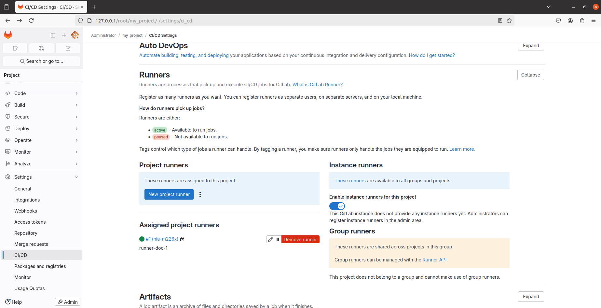
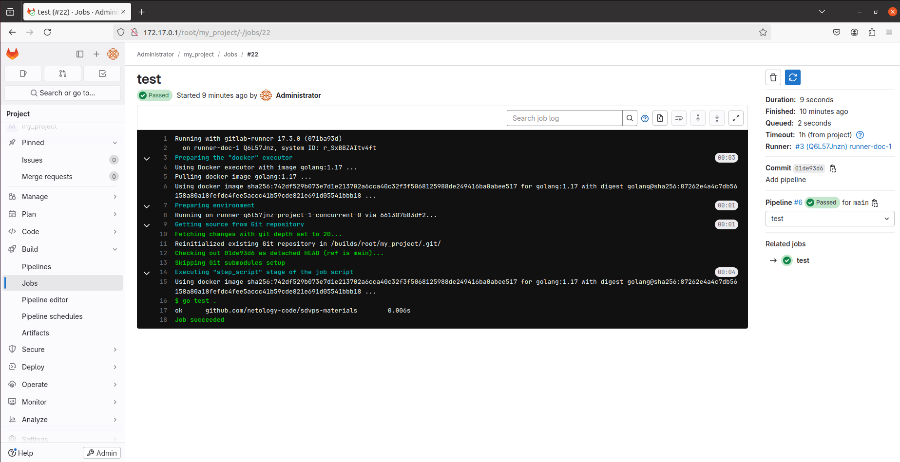
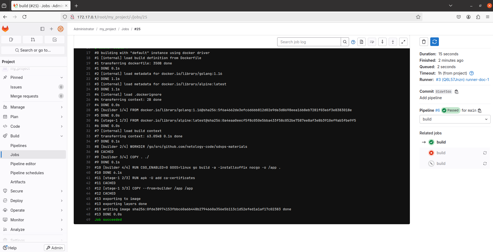
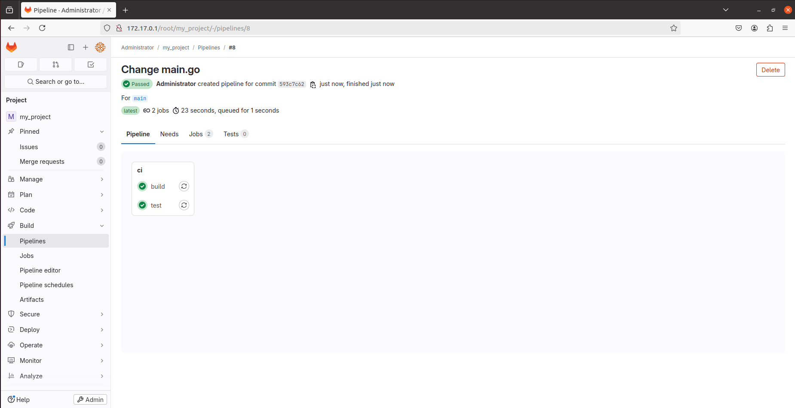

# Домашнее задание к занятию "`GitLab`" - `Виталий Коряко`

https://github.com/netology-code/sdvps-homeworks/blob/main/8-03.md 

## Задание 1

**Что нужно сделать:**

1. Разверните GitLab локально, используя Vagrantfile и инструкцию, описанные в [этом репозитории](https://github.com/netology-code/sdvps-materials/tree/main/gitlab).   
2. Создайте новый проект и пустой репозиторий в нём.
3. Зарегистрируйте gitlab-runner для этого проекта и запустите его в режиме Docker. Раннер можно регистрировать и запускать на той же виртуальной машине, на которой запущен GitLab.

В качестве ответа в репозиторий шаблона с решением добавьте скриншоты с настройками раннера в проекте.

## Решение 1

```
# install gitlab
download deb from https://packages.gitlab.com/gitlab/gitlab-ee then install
nano /etc/gitlab/gitlab.rb and change external_url to 172.17.0.1 # ip from docker subnet for using local and in docker
sudo gitlab-ctl reconfigure
cd /etc/gitlab
cat root_initial_password
root
zdb+vs2lED+8Momwrj/ZfFn8H3Ope5QPEf53pGn8Rh8=


# install docker
https://docs.google.com/document/d/1xaONQrqilPapDeNjztUmJg9tu900ykL_a-zDOGs55qg/edit?usp=sharing


# run gitlab_runner in docker
docker run -ti --rm --name gitlab-runner \
     -v /srv/gitlab-runner/config:/etc/gitlab-runner \
     -v /var/run/docker.sock:/var/run/docker.sock \
     gitlab/gitlab-runner:latest register

url 172.17.0.1 # ip from docker subnet for using local and in docker
token from project
docker shell
go:1.17 image

cd /srv/gitlab-runner/config
change config.toml with adding other volumes
and add actual host ip # if gitlab and gitlab runner on one machine and gitlab runner in docker - host ip in docker net

---
check_interval = 0
shutdown_timeout = 0

[session_server]
  session_timeout = 1800

[[runners]]
  name = "runner-doc-1"
  url = "http://172.17.0.1/"
  id = 1
  token = "nia-m226x1E4YtAcBg9c"
  token_obtained_at = 2024-08-18T13:26:07Z
  token_expires_at = 0001-01-01T00:00:00Z
  executor = "docker"
  [runners.custom_build_dir]
  [runners.cache]
    MaxUploadedArchiveSize = 0
    [runners.cache.s3]
    [runners.cache.gcs]
    [runners.cache.azure]
  [runners.docker]
    tls_verify = false
    image = "go:1.17"
    privileged = false
    disable_entrypoint_overwrite = false
    oom_kill_disable = false
    disable_cache = false
    volumes = ["/cache", "/var/run/docker.sock:/var/run/docker.sock"]
    shm_size = 0
    network_mtu = 0
---

# start runner
docker run -d --name gitlab-runner --restart always \
     -v /srv/gitlab-runner/config:/etc/gitlab-runner \
     -v /var/run/docker.sock:/var/run/docker.sock \
     gitlab/gitlab-runner:latest
```



## Задание 2

**Что нужно сделать:**

1. Запушьте [репозиторий](https://github.com/netology-code/sdvps-materials/tree/main/gitlab) на GitLab, изменив origin. Это изучалось на занятии по Git.
2. Создайте .gitlab-ci.yml, описав в нём все необходимые, на ваш взгляд, этапы.

В качестве ответа в шаблон с решением добавьте: 
   
 * файл gitlab-ci.yml для своего проекта или вставьте код в соответствующее поле в шаблоне; 
 * скриншоты с успешно собранными сборками.

## Решение 2

```
# create local repo from remote github
git clone https://github.com/netology-code/sdvps-materials.git
cd sdvps-materials
git remote rename origin old-origin
git remote add origin http://172.17.0.1/root/my_project.git
git push -u origin --all
git push -u origin --tags

root
root_initial_password


# create pipeline
nano .gitlab-ci.yml
---
stages:
  - test
  - build

test:
  stage: test
  image: golang:1.17
  script: 
   - go test .

build:
  stage: build
  image: docker:latest
  script:
   - docker build .
---

git config --global user.email "root@root.com"
git config --global user.name "root"

git add .gitlab-ci.yml
git commit -m "Add pipeline"
git push origin main

```





## Задание 3*

Измените CI так, чтобы:

 - этап сборки запускался сразу, не дожидаясь результатов тестов;
 - тесты запускались только при изменении файлов с расширением *.go.

В качестве ответа добавьте в шаблон с решением файл gitlab-ci.yml своего проекта или вставьте код в соответсвующее поле в шаблоне.

## Решение 3*

```
# change pipeline
nano .gitlab-ci.yml
---
stages:
  - ci

test:
  stage: ci
  rules:
    - changes:
      - '*.go'
      when: always
  image: golang:1.17
  script: 
   - go test .

build:
  stage: ci
  image: docker:latest
  script:
   - docker build .
---

```

