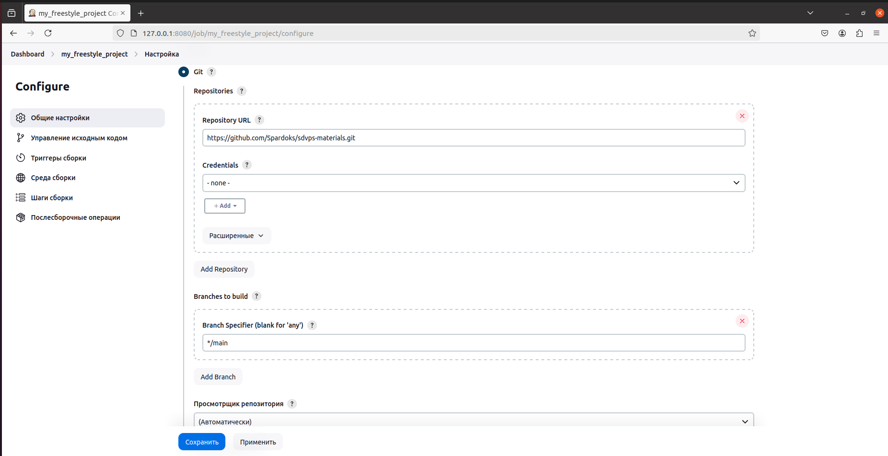
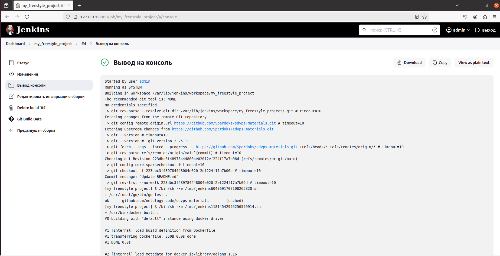
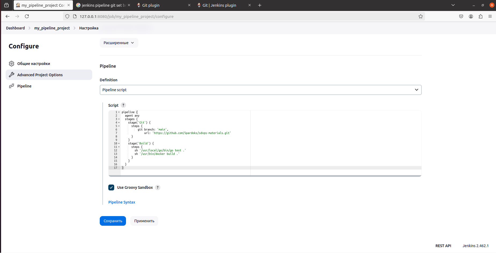
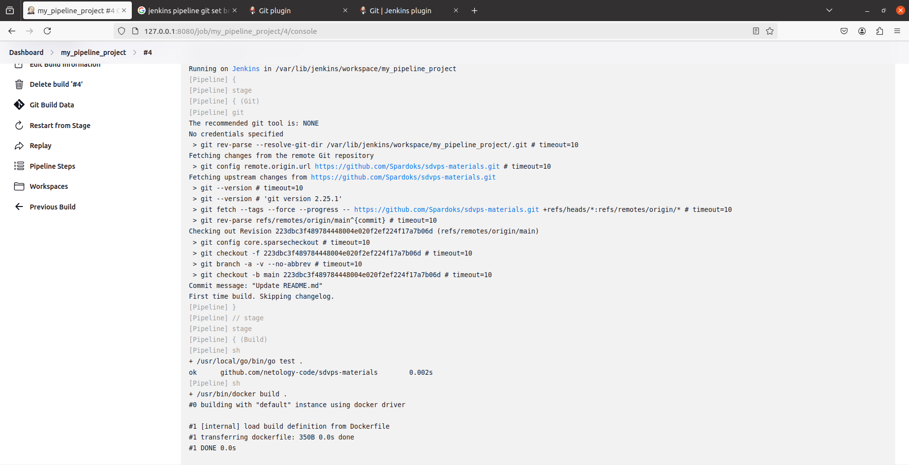
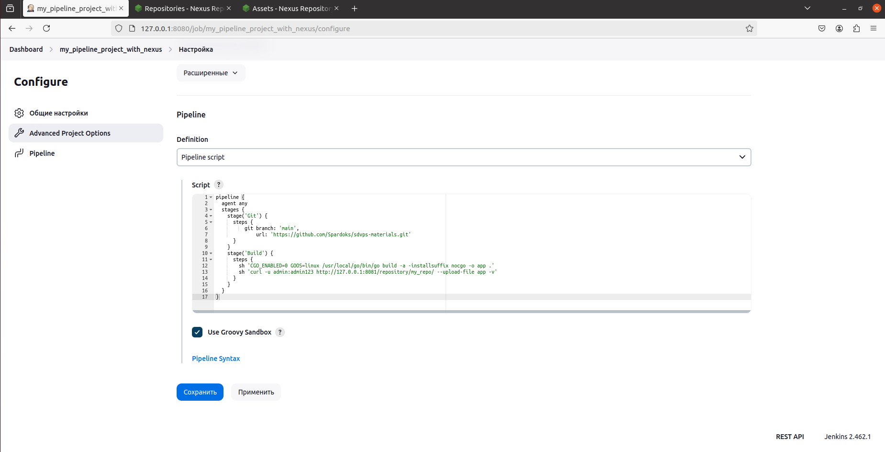
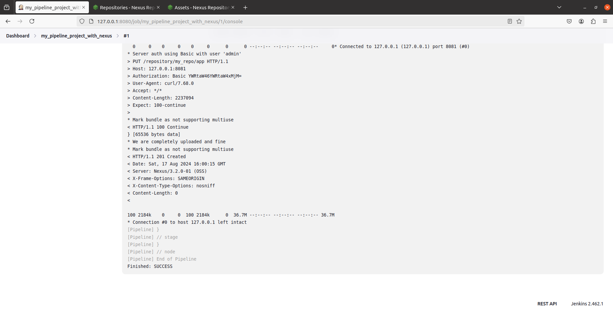
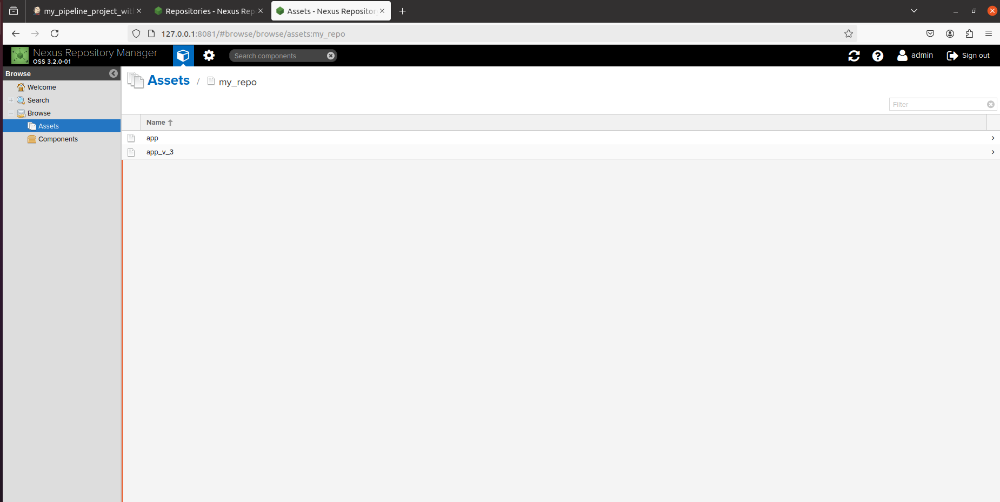

# Домашнее задание к занятию "`Что такое DevOps. СI/СD`" - `Виталий Коряко`

https://github.com/netology-code/sdvps-homeworks/blob/main/8-02.md 

## Задание 1

**Что нужно сделать:**

1. Установите себе jenkins по инструкции из лекции или любым другим способом из официальной документации. Использовать Docker в этом задании нежелательно.
2. Установите на машину с jenkins [golang](https://golang.org/doc/install).
3. Используя свой аккаунт на GitHub, сделайте себе форк [репозитория](https://github.com/netology-code/sdvps-materials.git). В этом же репозитории находится [дополнительный материал для выполнения ДЗ](https://github.com/netology-code/sdvps-materials/blob/main/CICD/8.2-hw.md).
3. Создайте в jenkins Freestyle Project, подключите получившийся репозиторий к нему и произведите запуск тестов и сборку проекта ```go test .``` и  ```docker build .```.

В качестве ответа пришлите скриншоты с настройками проекта и результатами выполнения сборки.

## Решение 1

```
# install docker
https://docs.google.com/document/d/1xaONQrqilPapDeNjztUmJg9tu900ykL_a-zDOGs55qg/edit?usp=sharing 

# install Jenkins
sudo apt-get install default-jre
curl -fsSL https://pkg.jenkins.io/debian-stable/jenkins.io-2023.key | sudo tee /usr/share/keyrings/jenkins-keyring.asc > /dev/null
echo deb [signed-by=/usr/share/keyrings/jenkins-keyring.asc] https://pkg.jenkins.io/debian-stable binary/ | sudo tee /etc/apt/sources.list.d/jenkins.list > /dev/null
sudo apt-get update
sudo apt-get install jenkins
sudo cat /var/lib/jenkins/secrets/initialAdminPassword
sudo usermod -a -G docker jenkins
sudo service jenkins restart

# install go
wget https://go.dev/dl/go1.23.0.linux-amd64.tar.gz
sudo rm -rf /usr/local/go && sudo tar -C /usr/local -xzf go1.23.0.linux-amd64.tar.gz
export PATH=$PATH:/usr/local/go/bin
echo 'export PATH=$PATH:/usr/local/go/bin' >> ~/.bashrc
go version

# goto jenkins 127.0.0.1:8080 and install just git plugin, create freestyle project with shell steps and repo lynk
/usr/local/go/bin/go test .
/usr/bin/docker build .

# run build
```





## Задание 2

**Что нужно сделать:**

1. Создайте новый проект pipeline.
2. Перепишите сборку из задания 1 на declarative в виде кода.

В качестве ответа пришлите скриншоты с настройками проекта и результатами выполнения сборки.

## Решение 2

```
# goto jenkins 127.0.0.1:8080 and install pipeline plugin, create pipeline project with shell steps and repo lynk
pipeline {
  agent any
  stages {
    stage('Git') {
      steps {
          git branch: 'main',
              url: 'https://github.com/Spardoks/sdvps-materials.git'
      }
    }
    stage('Build') {
      steps {
        sh '/usr/local/go/bin/go test .'
        sh '/usr/bin/docker build .'
      }
    }
  }
}
```





## Задание 3

**Что нужно сделать:**

1. Установите на машину Nexus.
2. Создайте raw-hosted репозиторий.
3. Измените pipeline так, чтобы вместо Docker-образа собирался бинарный go-файл. Команду можно скопировать из Dockerfile.
4. Загрузите файл в репозиторий с помощью jenkins.

В качестве ответа пришлите скриншоты с настройками проекта и результатами выполнения сборки.

## Решение 3

```
# install nexus from docker
docker run -d -p 8081:8081 --name nexus -e INSTALL4J_ADD_VM_PARAMS="-Xms273m -Xmx273m -XX:MaxDirectMemorySize=273m" sonatype/nexus3:3.2.0
# latest docker version has no raw-hosted that's why 3.2.0
# standard admin password there is admin123

# goto 127.0.0.1:8081, login with admin and create raw-hosted repo

# create new pipe in jenkins
pipeline {
  agent any
  stages {
    stage('Git') {
      steps {
          git branch: 'main',
              url: 'https://github.com/Spardoks/sdvps-materials.git'
      }
    }
    stage('Build') {
      steps {
        sh 'CGO_ENABLED=0 GOOS=linux /usr/local/go/bin/go build -a -installsuffix nocgo -o app .'
        sh 'curl -u admin:admin123 http://127.0.0.1:8081/repository/my_repo/ --upload-file app -v'
      }
    }
  }
}
```





## Задание 4*

Придумайте способ версионировать приложение, чтобы каждый следующий запуск сборки присваивал имени файла новую версию. Таким образом, в репозитории Nexus будет храниться история релизов.

Подсказка: используйте переменную BUILD_NUMBER.

В качестве ответа пришлите скриншоты с настройками проекта и результатами выполнения сборки.

## Решение 4*

```
pipeline {
  agent any
  stages {
    stage('Git') {
      steps {
          git branch: 'main',
              url: 'https://github.com/Spardoks/sdvps-materials.git'
      }
    }
    stage('Build') {
      steps {
        sh 'CGO_ENABLED=0 GOOS=linux /usr/local/go/bin/go build -a -installsuffix nocgo -o app .'
        sh 'curl -u admin:admin123 http://127.0.0.1:8081/repository/my_repo/app_v_$BUILD_NUMBER --upload-file app -v'
      }
    }
  }
}
```

